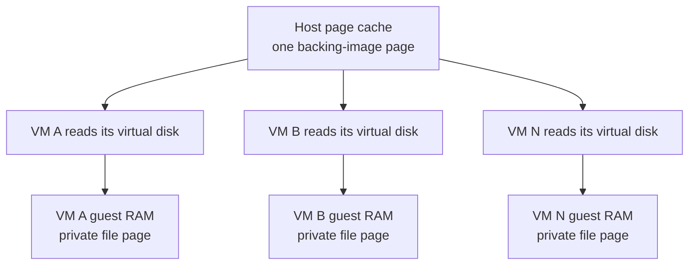

**TL;DR:** I tried to give each of my friends their own VM and accidentally
discovered a way to run 3.5× as many VMs at once on the same cluster.\*

OpenAI recently wired its Codex agent into the ChatGPT app: you can
[hand a task to an agent from your phone](https://openai.com/index/work-with-codex-from-anywhere/),
wander off, and come back to review what it built. Which is wonderful, until you
remember that your phone can only serve as a remote control: the agent itself
must run on another computer. If you'd like to use your agent at any time, that
computer must always be on and connected to the internet; otherwise, there is
nothing for your phone to control. Sadly, most of my non-technical friends have
neither a spare computer to leave running nor the appetite to rent one in the
cloud.

I own a server, so the solution was obvious: offer each friend a Linux VM on it
to serve as their second computer — somewhere their agent can live and make
things. The catch is that VMs take-up a _lot_ of RAM and disk. If I were to host
a VM for each friend on a single server, each VM would need to be far more
efficient than usual.

It turns out that most of the RAM and disk a VM consumes goes toward storing
software it has in common with every other VM: ten VMs would hold ten copies of
the same libraries and tools, such as Python and Git. This means identical data
is repeated on disk — for example, there are ten copies of Python, one per VM,
nine of which do nothing but waste storage space. Worse yet, that data is
duplicated again in RAM: when an agent uses a piece of software, its VM loads
its own copy into RAM, so if ten agents use the same software, the server ends
up holding ten copies.

So I set out to fix that inefficiency, and it worked:

**When VMs run side by side on one server, each now costs a fraction of the RAM
and disk it used to, so the same server runs 3.5× as many\*.**

The number of VMs that can fit on the same hardware is known as _VM density_ —
and that's what this blog is about. For a single VM, density optimizations
change nothing; savings grow with the number of VMs sharing the server.

## Two Ways to Deduplicate Data

The first way is active: let the copies come into existence, then run a
mechanism that finds them and merges them. Storage has filesystem deduplication,
where the filesystem searches for identical stretches of data and rewrites its
records so they share one stored copy. Memory has Linux Kernel Samepage Merging
(KSM), where a kernel thread scans RAM for identical pages and replaces
duplicates with one shared, write-protected page, copying it again the moment
anyone writes.

The downside is that active deduplication is slow, ongoing work: it acts only
after duplicates exist, so the system must scan for matches, track each merge,
and reverse it whenever somebody writes. In memory, that work also burns CPU and
weakens isolation by comparing and merging separate VMs' memory. That has
enabled cross-tenant
[side-channel attacks](https://en.wikipedia.org/wiki/Side-channel_attack). This
design still uses some active deduplication, but the less of this work it needs,
the better.

The second way is passive: arrange for the second copy never to exist by having
everyone read the data from a common source. If ten VMs read Python from one
shared location, there are no copies to discover, merge, track, or later
unmerge. That makes passive sharing faster: no deduplication pass is needed. It
also saves memory automatically: every VM reads the same underlying file, so the
host operating system can keep one cached copy in RAM and serve it to all ten.
More on that later.

So the strategy is this: share passively wherever possible, and reserve active
deduplication for everything else.

## Which Parts of a VM Can Be Shared?

Each VM holds two kinds of state (data). The common kind is pre-packaged public
software: the operating-system tools, libraries, and applications that anyone
can download, identical for everybody. The private kind is everything else:
documents, accounts, logs, settings, etc.

Isolation requires private state to stay private, but common state is safe to
share; there is no need to store it ten times.

Disk images do exactly that, though. They bake the common and private parts into
one disk, and cloning the disk clones everything — even though most bytes in the
clone will never differ from the original.

The usual fix is itself passive:
[copy-on-write](https://en.wikipedia.org/wiki/Copy-on-write) disk formats such
as QEMU's qcow2 let several VM disks draw from one read-only backing image and
record only their own changes. It has two limits, though. It only shares what
was in the base image when each VM was created; anything installed afterwards,
even the same package on two VMs, lands in private blocks the base can never
absorb. That's fine for an appliance whose software never changes; for a
development VM that installs things at runtime, the shared portion only decays.
The sharing also stops at the disk: once VMs start reading those blocks into
memory, the duplication comes back, and that problem gets its own section below.

Which sharpens the question:

> What is the largest class of data we can arrange to never duplicate in the
> first place — on disk and in memory?

For a development VM, it is the software itself: the common package set. So the
design problem becomes giving many isolated VMs one shared copy of their
software, without taking away anyone's freedom to install and build things. That
problem starts on disk.

## Imagine Every Package Had Its Own Folder

The usual Linux disk layout makes packages difficult to share between VMs.

Most Linux systems smear one package across several shared directories. A Python
installation puts commands in `/usr/bin`, libraries in `/usr/lib`, configuration
in `/etc`, and documentation somewhere under `/usr/share`. This is convenient
for programs, but it leaves no single, self-contained Python directory to share.

Imagine instead one directory — a package store — where every package, and every
version of every package, gets its own folder. (A distribution called
[GoboLinux](https://gobolinux.org/) actually arranges its filesystem this way.)

<pre style="line-height: 1; overflow-y: hidden"><code>/packages/
├── Python/
│   └── 3.13.5/
│       ├── bin/
│       └── lib/
├── Nginx/
│   └── 1.30.2/
│       ├── bin/
│       └── modules/
└── OpenSSL/
    └── 3.5.1/
        ├── bin/
        └── lib/
</code></pre>

Now “Python 3.13.5” has an address. If ten VMs need that exact folder, whether
it shipped with the VM or was installed this morning, we can store it once and
let all ten see it.

These folders are safe to share because each package becomes read-only once
installed. An upgrade installs the new Python version in a separate folder and
configures the VM to use it. The old folder stays unchanged, so programs already
using it keep working.

## Why We Cannot Simply Share `/packages`

The tempting shortcut is to mount one common `/packages` directory into every VM
and declare victory.

The shortcut fails as soon as one VM changes the shared directory. If VM A
uninstalls a package that VM B still needs, the package disappears from B too.
One VM can likewise fill the disk or corrupt the package store for everyone.
Even when nothing goes wrong, the common directory exposes software that should
remain private: anything proprietary that A builds would appear on B's disk too.

If we make the common directory read-only, we prevent that interference, but
nobody can install anything that isn't already available to everyone or add
private, custom builds of their own.

What each VM actually needs is one shared, read-only directory for common
packages and one private, writable directory for its own packages, presented
together as a single package store:

<pre style="line-height: 1; overflow-y: hidden"><code>What VM A sees in /packages/
├── Python/3.13.5/
├── Nginx/1.30.2/
├── OpenSSL/3.5.1/
└── ImageMagick/7.1/

What VM B sees in /packages/
├── Python/3.13.5/
├── Nginx/1.30.2/
├── OpenSSL/3.5.1/
└── FFmpeg/7.1/

■ the shared lower
■ A's private upper
■ B's private upper</code></pre>

In this layout, common packages come from one shared, read-only directory, while
anything a VM adds goes into its own writable directory. Inside each VM, the two
directories appear as one ordinary package store. A package lookup checks the
VM's private upper layer first, then falls through to the shared lower. A
package that A installs or builds lands only in A's upper, where B can neither
break it nor see it. B gets the same lower but its own upper. We could describe
this layout as an upper-lower sandwich.

Linux already includes a filesystem designed for exactly this kind of sandwich
layout: OverlayFS presents an upper and a lower directory as one merged view.
Lower files are read in place, new files land in the upper, and if software
tries to modify a lower file, OverlayFS first copies it into the upper and edits
the copy, leaving the shared original untouched. This copy-before-write step is
called a
[copy-up operation](https://docs.kernel.org/filesystems/overlayfs.html#non-directories).

## Nix Already Solves the Package Layout Problem

Nix, a package manager with a famously unorthodox design, already arranges
packages exactly this way; it just spells the names differently:

<pre style="line-height: 1; overflow-y: hidden"><code>/nix/store/
├── 4v1...-python3-3.13.5/
├── 8k2...-nginx-1.30.2/
└── n7z...-openssl-3.5.1/
</code></pre>

In Nix, store contents are never edited in place, and versions coexist side by
side — exactly what a shared package store requires. Nix even has a word for a
package together with everything it depends on: its _closure_.

Nix doesn't provide the whole sandwich by itself. OverlayFS merges the shared
and private directories, and Nix's local-overlay store support lets the package
manager treat the merged files, plus the matching metadata, as a real store.

\*\* This is not an incidental implementation choice: the solution relies on a
Nix-based container operating system. Nix's immutable, side-by-side package
store is what makes one shared lower store practical while each VM retains
private package management; this is not a drop-in optimization for any Linux VM.

(This technique has appeared in several forms: Nix has supported
[experimental local-overlay stores](https://releases.nixos.org/nix/nix-2.22.0/manual/store/types/experimental-local-overlay-store.html)
since version 2.22, released in April 2024, and I later found Replit's
[Super Colliding Nix Stores](https://replit.com/blog/super-colliding-nix-stores)
post describing how it uses a similar setup at much larger scale.)

For the shared lower layer itself, I use [Snix](https://snix.dev/), an
independent implementation of the Nix store. It exposes the store through
[FUSE](https://en.wikipedia.org/wiki/Filesystem_in_Userspace), and carries the
common closures these VMs need.

Each VM gets the same Snix-backed lower store, its own OverlayFS upper, and its
own writable Nix database and profiles. That last part matters: the upper holds
private package files and the database records that they exist.

Ten VMs that need the same nginx build now point at one stored copy — the
problem has changed from finding ten identical copies to handing one object to
ten VMs. On disk:

<pre><code>total storage
  = one shared package store
  + each VM's own extra packages
  + each VM's own data
</code></pre>

This solves the disk-duplication problem for common state. The shared package
closure occupies the same amount of space whether one VM uses it or a hundred.
What remains is private state, which grows independently inside each VM, so ten
VMs will still consume more disk than one. Active deduplication now becomes a
second-line cleanup for those smaller private upper layers rather than the
mechanism responsible for noticing that every VM contains the same base system.

## How the Shared Package Store Also Saves RAM

Disk is only half the story. Reading from disk is slow, so once Linux has read a
file it keeps the contents in the
[page cache](https://en.wikipedia.org/wiki/Page_cache), using otherwise-idle
RAM, and serves the next read of that file from memory. The part that matters
here is what happens when another program reads, or runs, the same file: the
kernel recognizes it as the same file and points both programs at the single
cached copy. This is passive deduplication happening in memory — nobody scans
anything; the sharing follows from every reader naming the same file. It is also
the second reason to give common package files one identity: the lower store
isn't just equal data stored efficiently, it is the same data, cached once, by
one host.

Any VM running its own guest kernel interrupts this: the host can cache the
common blocks of a qcow2 backing image, but each guest kernel sees a virtual
disk, reads those blocks, and caches them again in its own RAM:

The file identity that made passive sharing work is severed at the VM boundary:
from the host's point of view, each guest's cached copy is just guest memory,
with no connection to the file it came from. (This is exactly the situation KSM
was invented to repair — actively.) The guest kernels and their supporting
memory are also private to each VM, further increasing the cost of every
additional VM.

So the design needs an isolation mechanism that doesn't put a whole separate
Linux kernel and a fixed block of guest RAM between the applications and the
host-managed files.

## Why gVisor Preserves the Memory Sharing

An isolation mechanism that skips the guest Linux kernel already exists: gVisor,
a sandbox built at Google. Its core is the Sentry, a user-space application
kernel: an ordinary host process that implements the Linux system-call interface
and other operating-system services for applications inside the sandbox. Those
applications never issue system calls to the host directly; the Sentry handles
them and uses a deliberately small set of host system calls when needed.

gVisor can use
[KVM](https://en.wikipedia.org/wiki/Kernel-based_Virtual_Machine), Linux's
hardware-virtualization interface (the CPU-level acceleration that makes VMs
fast), to wall off the memory of the guest (the isolated environment running our
applications) from the host. In this mode, the Sentry fills the roles of both
guest operating system and
[hypervisor](https://en.wikipedia.org/wiki/Hypervisor). However, the guest is
still a group of processes, rather than an emulated computer with virtual
hardware and a separate guest Linux kernel.

So is this a VM? If we stretch the definition of 'VM', yes: the guest runs under
real hardware virtualization, and its applications never touch the host kernel
directly. As most people would define it, gVisor isn't a VM.

I still think that the VM-density claims made in this post are justified:
traditional VMs can achieve the same page-sharing behaviour demonstrated using
gVisor. I used gVisor because it fits the Kubernetes infrastructure I tend to
deploy on, such as Amazon EKS. However, a QEMU VM can mount a shared filesystem
with DAX, allowing it to use file contents from the host's cache rather than
keeping another copy in its own page cache. Notably, its guest kernel would
still consume RAM, narrowing the density advantage unless that overhead were
mitigated.

\*\*\* The measurements in this article are of gVisor sandboxes on
KVM, not traditional VMs. A traditional VM using a shared filesystem with DAX
could achieve the same page sharing, but that design was not tested here.

gVisor is convenient for demonstrating this shared-cache design because its VMs
can directly share the host's reclaimable page cache instead of maintaining
opaque page caches of their own.

With Directfs, a file read travels from the application through gVisor's Sentry
(the layer between the VM and the host) into the host's OverlayFS (the
package-store sandwich). For a shared package, OverlayFS selects the Snix FUSE
lower layer. The host kernel then checks its page cache for that Snix file: the
first read fetches the pages from Snix and caches them in host RAM; because
every VM resolves the package to the same Snix file, later reads reuse those
same pages.

Each guest still needs RAM for the Sentry, its record of running processes and
open files, and active work. gVisor's
[resource model](https://gvisor.dev/docs/architecture_guide/resources/) has the
details. The bet is that the shared software sits in memory once, while each
extra VM adds only this private runtime state.

## The Two Systems I Built and Compared

To measure how much this design improves VM density, I built two systems and ran
them head to head on the same nginx workload — the code for the exact comparison
and VM configurations lives
[on my GitHub](https://github.com/ToxicPine/nix-container/tree/benchmarking).

The shared-store side is the test case: it runs
[nix-container](https://github.com/ToxicPine/nix-container) under gVisor's
`runsc` on KVM; the repository has the full details. Each gVisor VM gets a
standard OCI container root filesystem, a persistent private `/data`, a
persistent private `/nix` database and profile area, a private OverlayFS upper
and work directory, and a merged `/nix/store` whose lower layer is the shared
Snix store. The container itself is very skeletal: a small process supervisor
runs nginx, nothing more. `runsc` is configured with Directfs, the internal
rootfs overlay, and exclusive bind-mount caching.

The baseline is a traditional NixOS VM: it boots its own kernel and manages its
own software, the way a rented VPS does. It runs the same pinned nginx package
and configuration on a minimal image produced by the upstream NixOS image
builder, with a working Nix installation, daemon, and writable store, nginx
under systemd, an independently prepared qcow2 overlay over one read-only
backing image, and a direct kernel boot under QEMU's stripped-down `microvm`
machine type with one vCPU and 256 MiB RAM. Everything QEMU would normally
emulate for a general-purpose VM, including firmware, PCI, a display, and the
default device set, is switched off, leaving about as lean a VM as QEMU can
produce. The tuning is meant to keep the test fair: the baseline should be a
genuinely well-optimized VM on a minimal OS, so that beating it means something.

The two sides still aren't perfectly like-for-like: one is an OCI image under a
minimal supervisor, the other a NixOS disk image under systemd, so their
closures and init machinery differ a little. As a hedge, I also ran the VMs with
KSM on, giving `ksmd` all the time it needed to deduplicate as thoroughly as it
can. KSM merges the VMs against each other, with no cross-image comparison
involved, so its savings independently show how much duplicate memory a fleet of
identical VMs carries. If the KSM figure lands near the shared-store one, that's
telling in itself: both mechanisms would be removing the same duplication, one
after the copies exist and one by never creating them.

## How I Keep the Comparison Fair

It is easy to report “3.5× as many VMs” without establishing whether those extra
VMs remain usable in practice, so I wanted the comparison to answer three
questions:

1. What are the fixed and marginal host-memory costs, and how many healthy VMs
   fit inside one RAM envelope?
2. How long does a prepared VM take to serve a correct nginx response?
3. At equal CPU, what throughput and tail latency can each target sustain?

Two measurement choices matter more than the rest. First, memory is measured
after VMs have actually served traffic, because idle VM RAM looks cheap: a VM's
memory is only truly allocated once the VM touches it, and a VM that has served
requests and read its package closure can hold far more private resident data.
Second, I count the memory used by the whole deployment, not just the memory
attributed to each VM. For gVisor, I count each Sentry, the Snix and FUSE
services that supply packages, and the host's file cache. For traditional VMs, I
count QEMU, each VM's guest kernel and RAM, disk-image bookkeeping, and the
host's file cache. The headline number is simply how much the whole server's
memory use rises with each VM added.

The rest is standard rigor: VMs fully prepared before the timer starts,
readiness defined as three consecutive correct HTTP responses, pinned CPUs, and
swap disabled.

## Results

> The latest benchmark run measured a 4.1× density improvement, as reported
> below. However, the harness still shows unexplained variation between runs, so
> I have kept the more conservative 3.5× headline from the first run. {:
> .prompt-info }

For context, the known fixed costs: gVisor's Sentry adds
[a few tens of MiB per sandbox](https://gvisor.dev/docs/architecture_guide/performance/),
a stripped-down QEMU sits in the tens of MiB
([Firecracker](https://github.com/firecracker-microvm/firecracker/blob/main/SPECIFICATION.md)
shows a VMM can get under 5), and each traditional VM here also reserves its 256
MiB of guest RAM.

For the common package closure, storage sharing should be close to perfect:
every gVisor VM uses the same immutable store paths, so the shared packages
occupy one physical copy. Only each VM's private upper layer adds per-VM
storage.

### Time from Launch to Ready

| Cache Condition | Target              |      Median |         p95 | CPU Time to Ready |
| --------------- | ------------------- | ----------: | ----------: | ----------------: |
| Host-cold       | NixOS VM            | **6.214 s** | **6.243 s** |       **4.196 s** |
| Host-cold       | gVisor shared store | **3.843 s** | **3.909 s** |       **4.751 s** |
| Cross-VM warm   | NixOS VM            | **5.164 s** | **5.196 s** |       **3.976 s** |
| Cross-VM warm   | gVisor shared store | **2.553 s** | **2.638 s** |       **3.194 s** |

A minimal readiness daemon with a negligible closure acts as the control here:
subtracting its launch time from nginx's separates platform startup from loading
and starting the actual workload.

### Memory Use and VM Density

| Target              | Fixed Platform Cost | Marginal Idle Memory | Marginal Post-Load Memory | Maximum Healthy VMs |
| ------------------- | ------------------: | -------------------: | ------------------------: | ------------------: |
| NixOS VM            |       **451.5 MiB** |        **291.0 MiB** |             **286.7 MiB** |              **47** |
| gVisor shared store |       **276.3 MiB** |         **78.3 MiB** |              **78.2 MiB** |             **195** |

The VM counts are observed healthy maxima inside the envelope, not projections
from marginal costs.

The headline claim lives in this table, as both absolute counts and a ratio:

> Within a host memory envelope of 16 GiB, the benchmark ran 195 healthy gVisor
> VMs running nginx versus 47 NixOS VMs: 4.1× as many. Its post-load marginal
> memory cost was 78.2 MiB per VM, compared with 286.7 MiB for the traditional
> VM.

\* The headline's asterisk, then: “3.5× as many” counts simultaneously healthy
VMs inside the same fixed host-RAM envelope, after a common nginx workload has
made the relevant software resident. Both targets run the same pinned nginx
build and configuration, use the same CPU allocation and direct network path,
and must meet the same error-rate and p99-latency objective. The figure does not
claim that every workload or every byte of private state scales by the same
ratio.

If shared-store page-cache reuse works as intended, the host should keep one
cached set of the nginx executable, libraries, and other closure files even as
more gVisor VMs are created. By contrast, traditional VMs keep separate cached
copies of those files in each VM's RAM, so memory devoted to the common closure
rises with the VM count.

### Storage Use and VM Density

| Target              | Fixed Shared Storage | Marginal Private Storage |
| ------------------- | -------------------: | -----------------------: |
| NixOS VM            |         **1.48 GiB** |             **1.92 MiB** |
| gVisor shared store |         **1.10 GiB** |             **8.53 MiB** |

The marginal figures are not exactly like-for-like: `nix-container` keeps unique
per-container configuration in its private storage, while the NixOS VM has no
equivalent per-VM configuration payload.

The NixOS row counts one read-only base image and each VM's private qcow2
overlay. The gVisor row counts one shared Snix store and each VM's private upper
layer and metadata.

### Nginx Throughput and Latency

| Workload                | Target              | Requests/s |            p50 |            p99 |
| ----------------------- | ------------------- | ---------: | -------------: | -------------: |
| Small, keep-alive, c=1  | NixOS VM            |  **6,733** |   **0.140 ms** |   **0.185 ms** |
| Small, keep-alive, c=1  | gVisor shared store |  **3,938** |   **0.250 ms** |   **0.290 ms** |
| Small, keep-alive, c=32 | NixOS VM            |  **8,234** |   **3.872 ms** |   **4.228 ms** |
| Small, keep-alive, c=32 | gVisor shared store | **38,381** |   **0.798 ms** |   **1.292 ms** |
| 1 MiB, keep-alive, c=32 | NixOS VM            |  **275.2** | **116.452 ms** | **119.752 ms** |
| 1 MiB, keep-alive, c=32 | gVisor shared store |  **373.3** |  **85.701 ms** |  **87.157 ms** |

Each figure is the median of three 60-second measurements. We measure
performance alongside density because packing more VMs onto the same cluster is
worthless if each becomes too slow to use.

### Density with KSM Enabled

This is the hedge promised earlier: I repeat the same test with KSM switched on
for the traditional VMs, and charge the scanner's CPU time to the VM side:

| Configuration       | Marginal Post-Load Memory | Maximum Healthy VMs |     ksmd CPU |
| ------------------- | ------------------------: | ------------------: | -----------: |
| NixOS VM, KSM on    |             **114.6 MiB** |             **142** | **245.48 s** |
| NixOS VM, KSM off   |             **286.7 MiB** |              **47** |            — |
| gVisor shared store |              **78.2 MiB** |             **195** |            — |

Turning KSM on cut marginal memory by 172.1 MiB per VM, from 286.7 MiB to 114.6
MiB, a reduction of 60%. That still left each VM 36.4 MiB above the gVisor
design. Each VM carries QEMU and its supporting virtualization state, while the
gVisor solution may have lower per-VM runtime overhead. So, the remaining gap is
therefore not necessarily memory that KSM failed to deduplicate.

However, KSM saves memory only after `ksmd` has scanned newly loaded pages,
found duplicates, and merged them. The measured 60% reduction is steady-state
memory use, recorded after KSM's shared-page count had had time to stabilize.
When several VMs load the same resource, each initially keeps its own copy in
RAM, so memory rises until `ksmd` finds and merges those copies. `ksmd` also
eats CPU time that should be available for running workloads.

## Objections Worth Taking Seriously

### Won't CPU Become the Bottleneck?

Well, it depends on your circumstances. If, like me, you're giving people VMs
where their agents can live and work, most of those VMs will sit nearly idle
much of the day. It would also be less than ideal to ask each person to suspend
and resume their VM between tasks, so the VMs need to keep running. They
therefore occupy memory all day while using CPU only intermittently, making it
sensible to overcommit CPU and minimize the RAM used by each VM. If everyone
starts CPU-heavy work at once — a build, for example — CPU becomes the
bottleneck, but I don't expect that to happen often in my case; ordinarily,
keeping all those mostly idle VMs light on RAM matters more.

### Why Not Mount the Shared Store into a Traditional VM?

That is a legitimate third design: a shared filesystem passed into the VM
([virtiofs](https://virtio-fs.gitlab.io/), with DAX) can carry file sharing
across the VM boundary. It also changes the isolation, caching, failure, and
performance model, and the VM still keeps its guest kernel and other private
memory. It deserves a follow-up experiment of its own; this one deliberately
keeps its baseline a independently package-managed NixOS VM rather than quietly
turning it into a different architecture.

### Does the qcow2 Backing Image Already Deduplicate the VMs?

It deduplicates most of the storage, which is why the benchmark uses it. It
leaves the guest kernel, the fixed guest-RAM allocation, and the guest page
cache: when several VMs read the same backing block, the host caches it once and
each VM caches it again. That gap between shared backing storage and shared
resident pages is exactly why the benchmark measures post-load whole-host
memory.

### Why Not Use KSM with Traditional VMs?

KSM is the all-active alternative: keep traditional VMs and repair the
duplication afterward. It was built for exactly this. The
[kernel documentation](https://docs.kernel.org/admin-guide/mm/ksm.html)
describes `ksmd` periodically scanning registered memory, merging identical
pages into one write-protected page, and copying again on write. It can
genuinely improve VM density, which is why the results above include a
KSM-enabled run.

I didn't make it the headline configuration for three reasons: it burns CPU and
bookkeeping rediscovering that VMs' pages are identical, after every VM has
already loaded its own copy; its savings arrive only after the scanner has
caught up, rather than existing from the moment a file is read; and merging
private VM memory creates side-channel risks, whereas the shared-store design
limits sharing to packages that are already public and read-only.

### Does Sharing the Page Cache Expose One VM to Attacks from Another?

Yes, sharing a page cache creates a security risk, and the easiest way to
understand it is to follow what happens to a file as it moves in and out of
memory. The page cache has limited space, so once it fills up, the host makes
room by removing pages that have not been used recently — a process called
eviction. If a VM reads a file after its pages have been evicted, it brings them
back into the cache, which makes later reads much faster. An attacker can
measure that difference by choosing the pages they want to watch, reading enough
unrelated files to evict them, then waiting while another VM runs. They then
read each chosen page and record how long it takes: a page the other VM did not
use must be loaded from storage and takes longer, while one it did use is
already back in the cache and returns quickly. This tells the attacker which
pages the other VM accessed, and repeating the process across several pages from
the same program can reveal what it is doing. If the program chooses which page
to read next according to a secret value — for example, a cryptographic key —
the resulting pattern can expose enough information for the attacker to
reconstruct that value.

Nix gives us a way to limit this risk because package definitions can carry
extra information about how their store paths should be handled. When
`nix-container` assembles the store presented to each VM, it could use that
information to place safe paths in the global page cache while giving sensitive
paths cache pages private to that VM. Both kinds of path could still live once
in the same content-addressed Snix store; only the way they are presented to
each VM would change. Most packages would therefore keep the memory savings of
the shared cache, while the paths that need stronger isolation would give up
those savings. I have not built or measured this split here, so working out
exactly how to implement it is important future work and deserves a follow-up of
its own.

### What About Firecracker?

Firecracker, AWS's minimal VMM built to run Lambda, is the natural “lighter VM”
counter-proposal, and on hypervisor overhead it delivers: the VMM process holds
itself
[under 5 MiB per microVM](https://github.com/firecracker-microvm/firecracker/blob/main/SPECIFICATION.md),
against the tens of MiB even a stripped-down QEMU carries. It avoids much of the
QEMU-specific overhead charged to every VM, so it would narrow the gap in these
results. If paired with the DAX-based shared-store design described above, it
could also achieve host-page-cache sharing across VMs.

However, Firecracker's tooling is thinner than QEMU's: disks are raw files with
no qcow2 backing chains. The baseline is meant to represent a normally hosted
VM, where many private disks share one read-only image through copy-on-write. A
Firecracker comparison would have to preserve that property; otherwise it would
change the storage model. Providing equivalent copy-on-write sharing beneath raw
disks would require an additional host storage layer that I could not guarantee
was comparable, which is why I did not use Firecracker here.

## Future Experiments and Improvements

The first benchmark to add is a traditional VM that mounts a shared package
store through [virtiofs with DAX](https://virtio-fs.gitlab.io/). It could
preserve host-page-cache sharing without removing the guest kernel, making it
the closest traditional-VM version of this design. A second benchmark would
replace QEMU with Firecracker, separating QEMU's overhead from the cost of the
guest kernel itself.

The implementation has two storage paths to optimize. For the shared lower, I
want to profile the FUSE-to-`snix-castore` path; Snix's
[local-overlay guide documents known castore performance issues](https://snix.dev/docs/guides/local-overlay/)
and expects the mount to be slower than a native filesystem. We could start by
pairing the castore with a faster backing filesystem. A deeper option is a
Snix-aware integration with gVisor's Gofer that bypasses FUSE and OverlayFS; we
would need to test whether removing those layers outweighs the cost of Gofer
RPCs. For the private uppers, we could choose a filesystem suited to targeted
deduplication and measure how much duplicate data remains.

I also want this design to scale on public infrastructure such as AWS without
giving containers `CAP_SYS_ADMIN`. The
[`nix-container`](https://github.com/ToxicPine/nix-container) project already
avoids that: it creates each OverlayFS mount outside the container and passes in
the merged view. However, a privileged mount operation is still required on the
host. I want to explore an unprivileged way to compose the shared lower and
private upper, perhaps as part of the Snix/gVisor integration.

Finally, I want to preserve lazy loading whether the store is exposed through
FUSE or Gofer. With
[lazy store materialization](https://snix.dev/docs/reference/snix-castore-api/#materializing-store-paths-on-disk),
a package can appear in `/nix/store` before all of its contents have been
downloaded. When a VM first opens one of its files, the storage layer fetches
that file from a substituter — a Nix package server — and caches it locally.

## The Core Idea in One Sentence

The whole idea fits in one sentence:

> If ten VMs use the same software packages, store them once and let one shared
> memory manager cache their pages.

A system built that way should cost roughly

<pre><code>one common software working set
    + N × genuinely private VM state
</code></pre>

rather than

<pre><code>N × (common software working set + private VM state)
</code></pre>

Every VM still has marginal cost, and a workload dominated by huge private heaps
or private writes benefits less than one dominated by common executables,
libraries, interpreters, and read-mostly package data.

Outcome: a server that used to host a handful of VMs can now run VMs for 3.5× as
many people.
